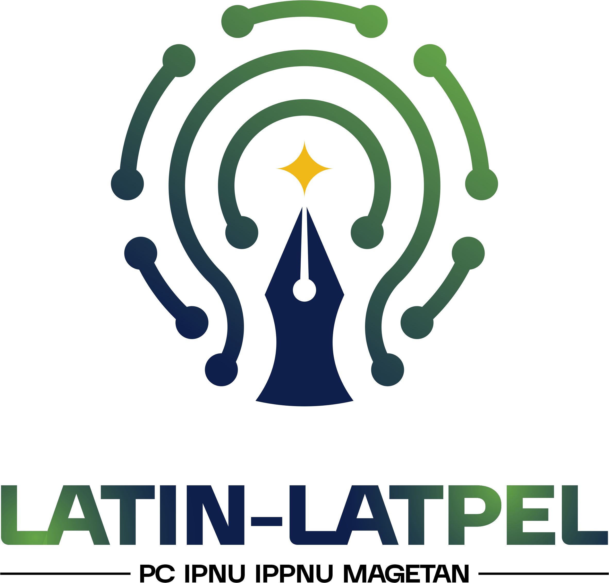

  

<h1 align="center">Portal Pendaftaran LATIN & LATPEL 2026</h1>

  Portal resmi pendaftaran Latihan Instruktur (LATIN) dan Latihan Pelatih (LATPEL) 
   
  Pimpinan Cabang Ikatan Pelajar Nahdlatul Ulama & Ikatan Pelajar Putri Nahdlatul Ulama Kabupaten Magetan.

  
  
  
  
  
  

---

## 📖 Tentang Sistem

Sistem ini adalah portal pendaftaran *Single Page Application* (SPA) yang dirancang khusus untuk memfasilitasi proses rekrutmen peserta pelatihan kader instruktur (LATIN) dan pelatih (LATPEL) PC IPNU IPPNU Kabupaten Magetan tahun 2026. 

Sistem ini memastikan pengumpulan data peserta, unggahan berkas administratif, hingga proses *screening* berjalan secara terpusat, modern, dan sangat cepat tanpa adanya *page reload*.

🔗 **URL Resmi:** [lala.pelajarnumagetan.or.id](https://lala.pelajarnumagetan.or.id)

---

## ✨ Fitur Utama

- **Pendaftaran Tanpa Reload (SPA):** Formulir pendaftaran menggunakan arsitektur SPA yang memberikan pengalaman pengguna sangat halus dan responsif.
- **Validasi Keamanan Ekstra:** Dilengkapi dengan perlindungan anti-spam melalui **Cloudflare Turnstile** dan validasi *strict* untuk mencegah injeksi karakter berbahaya.
- **Notifikasi Email Otomatis:** Sistem akan secara otomatis mengirimkan email konfirmasi resmi beserta tautan grup WhatsApp melalui sistem antrian (*queue* di latar belakang).
- **Penyimpanan Berkas Terdistribusi:** Semua unggahan berkas (PDF, Foto) langsung diunggah dengan aman menuju **Cloudflare R2 Storage (S3 API)**.
- **Dashboard Admin Interaktif:** 
  - Panel keputusan (Terima/Tolak) untuk tahap **Administrasi** dan **Screening**.
  - Manajemen pengaturan ketersediaan pendaftaran.
  - Fitur Hapus Data yang secara otomatis akan menghapus dan membersihkan *file* fisik di *cloud storage*.

---

  <i>Dikembangkan oleh Departemen IT PC IPNU IPPNU Kabupaten Magetan © 2026</i>

